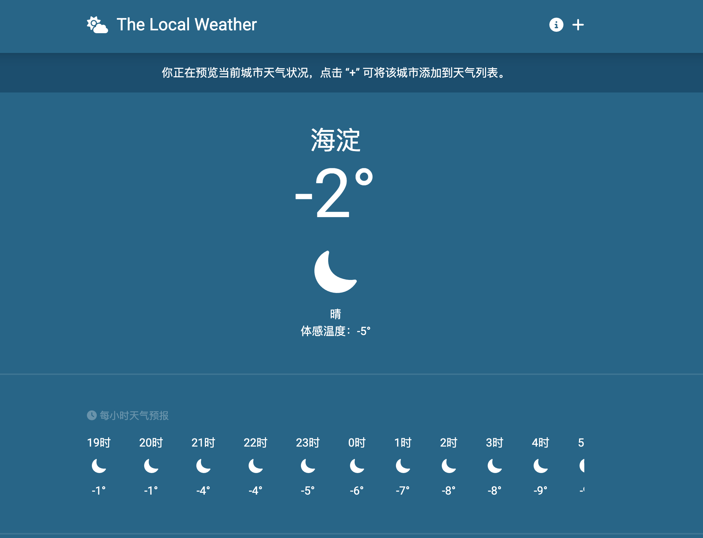
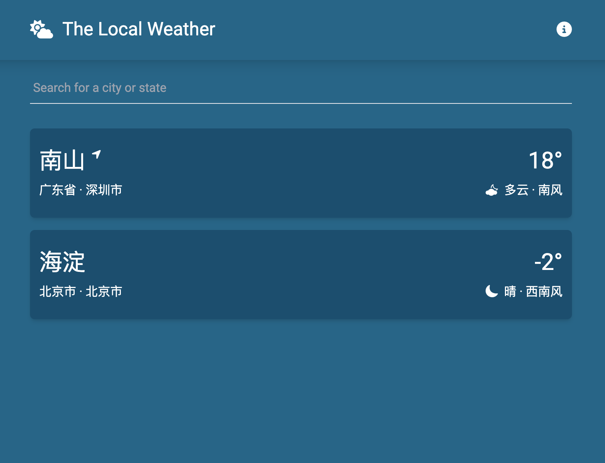
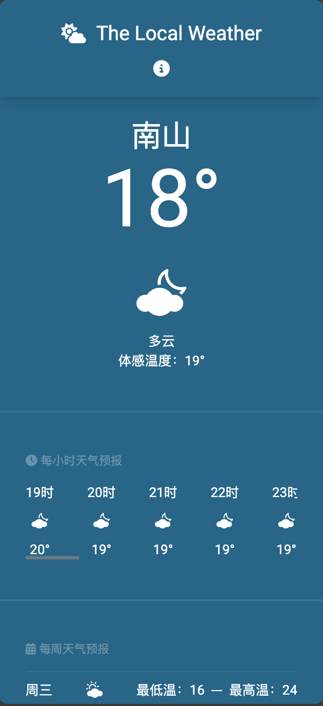

# vue-weather

这是一款简易即时天气应用，可以获取本地天气（需开启定位权限），可以将城市添加到首页列表，点击城市列表项可以看到城市天气信息，包括未来24小时天气和未来一周天气。

## Project Setup

```sh
npm install
```

### Compile and Hot-Reload for Development

```sh
npm run dev
```

### Compile and Minify for Production

```sh
npm run build
```
## 项目效果






